# Popular-Movies-Stage-II

   
<br />
Submission for Android NanoDegree Project

## Contents
**#1 [Movie Feast - II](https://github.com/SyamSundarKirubakaran/Popular-Movies-Stage-II)** 
- Nano Degree Submission - Popular Movies Stage II

## Preliminary works
- Check out my [AndroidWorks](https://github.com/SyamSundarKirubakaran/AndroidWorks) Repository to find out how I learnt step by step to accomplish this result.

## Movie Feast - II:
An app that uses the [Movies.db API](https://www.themoviedb.org/?language=en) to find the popular movies,Top rated,Now playing and Up coming movies in realtime and inflate the activities with the data of those movies accordingly. <br />

**Things I've Learnt:**
* Working with [Movies API](https://www.themoviedb.org/?language=en)
* [Networking in Android](https://developer.android.com/training/basics/network-ops/connecting.html)
* JSON parsing
* Scrolling view
* Picasso
* Bottom Navigation Bar
* Grid View
* Play videos in YouTube using implicit intents
* Favorite movies tracking
* Content Providers
* SQLite Databases
* Working with URIs
* Using share Intent
* Handle Requests in absence of network
* Offline Storage of favorite movies
* Bug fix<br />

**Popular movies in the form of JSON:** <br />
<br />
`https://api.themoviedb.org/3/movie/popular?api_key= <<YOUR_API_KEY>> ` <br />
<br />
`https://api.themoviedb.org/3/movie/top_rated?api_key= <<YOUR_API_KEY>> ` <br />
<br />
**Note:**<br />
Get your API key and place it in the strings.xml file in the resource directory.(NOTE: Marked as TODO in strings.xml file)<br />
``` xml
<string name="API_Key">Your API Key</string>
```
**Show case:**<br />
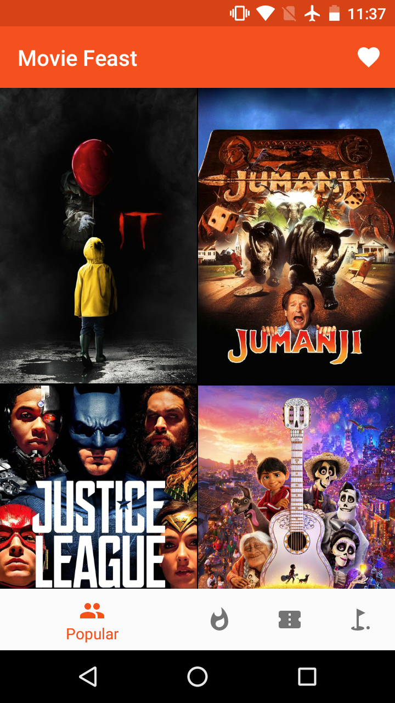
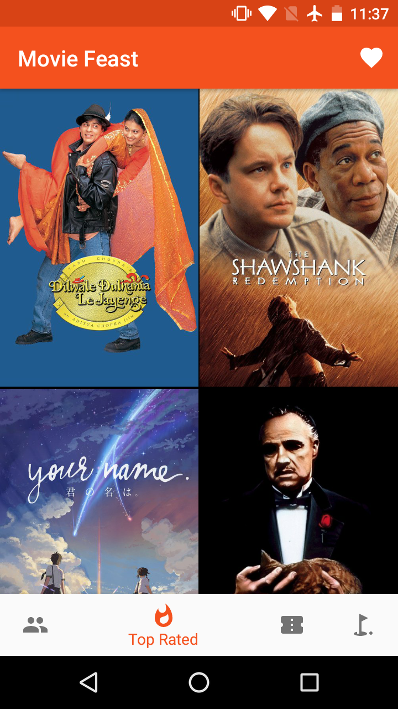
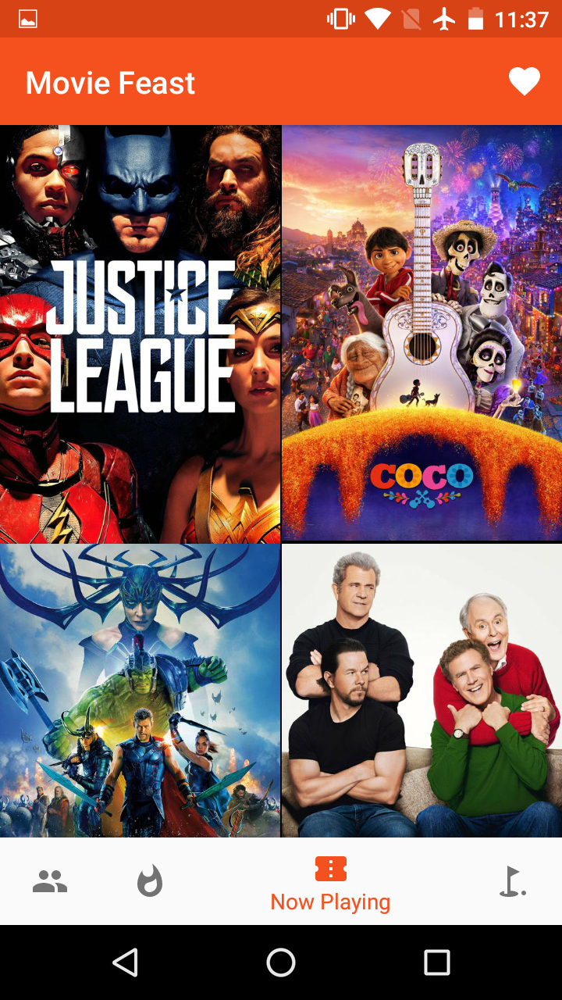
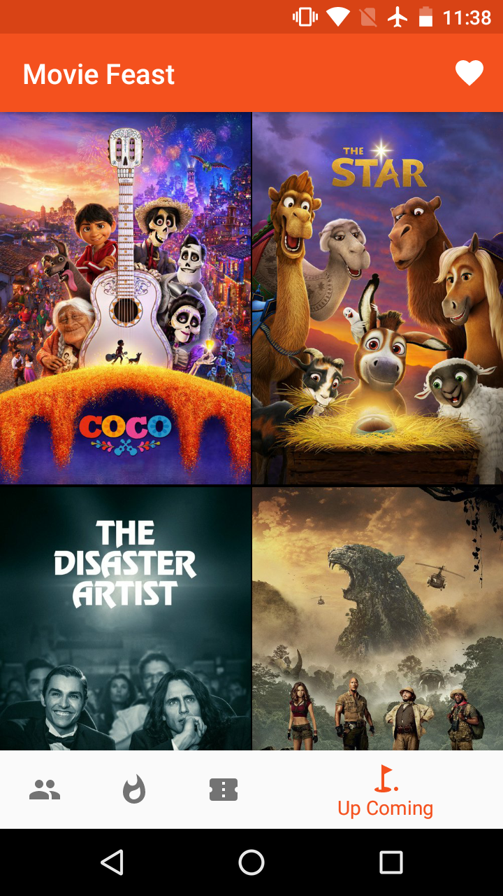
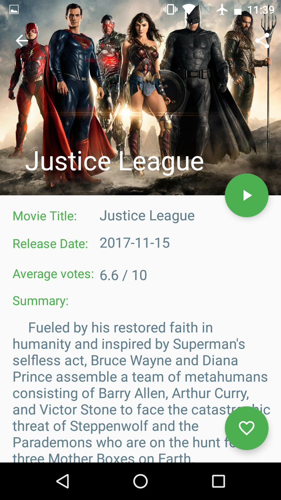
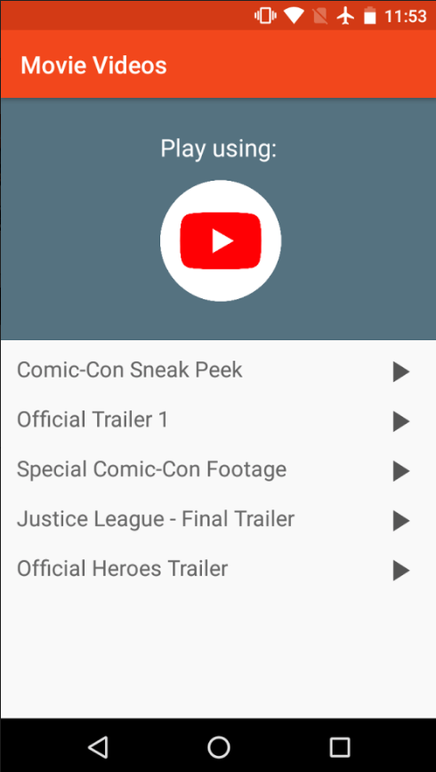

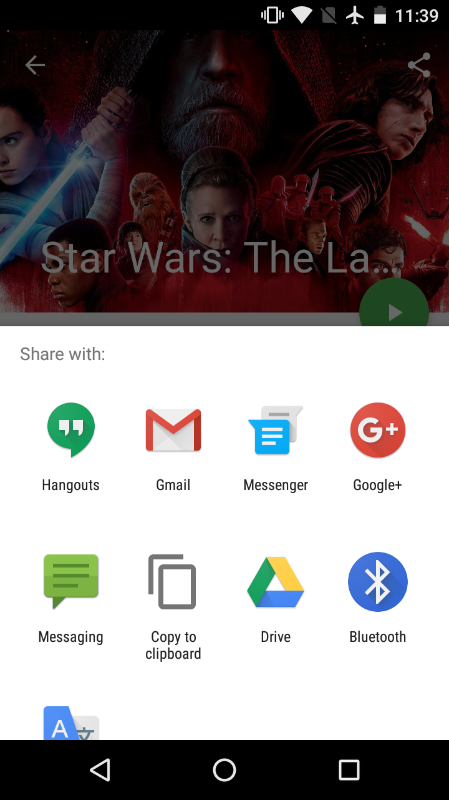
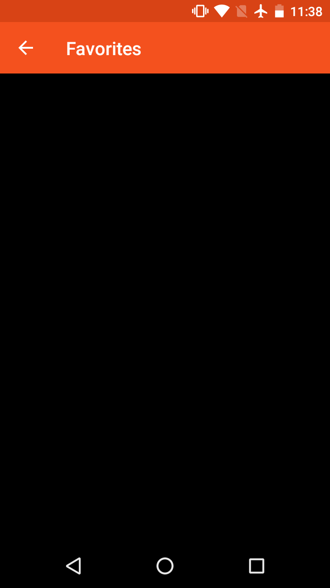
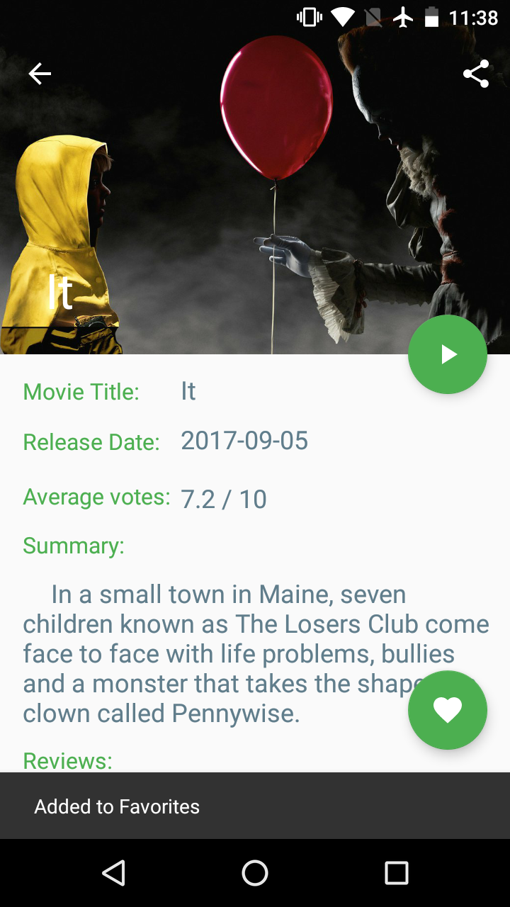
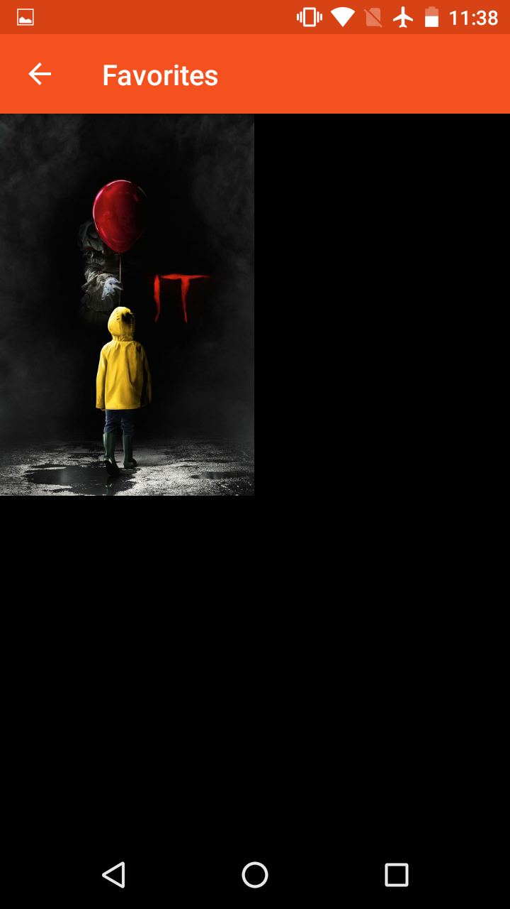
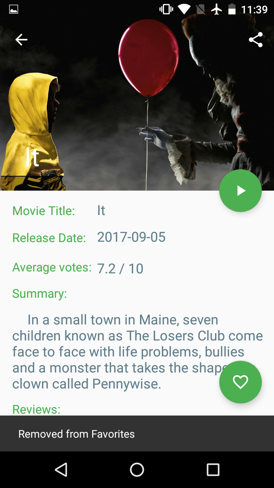<br />
**In absence of Network:**<br />
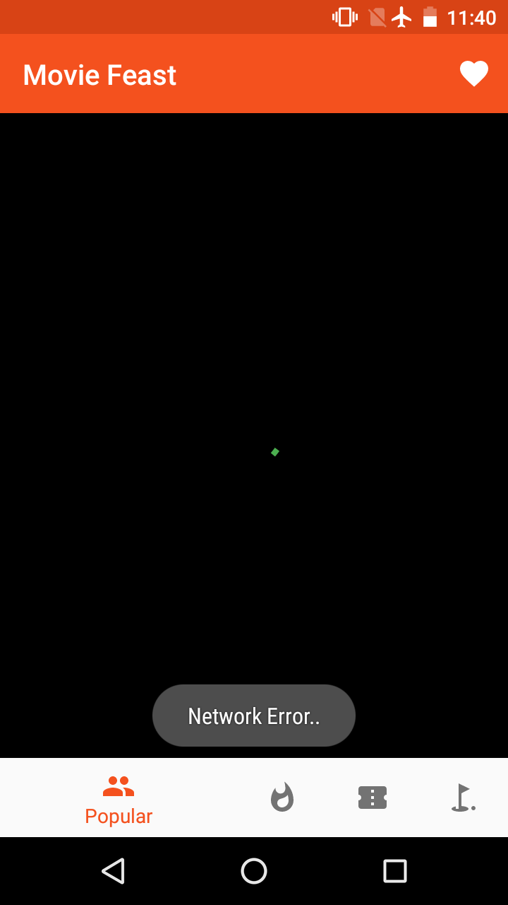
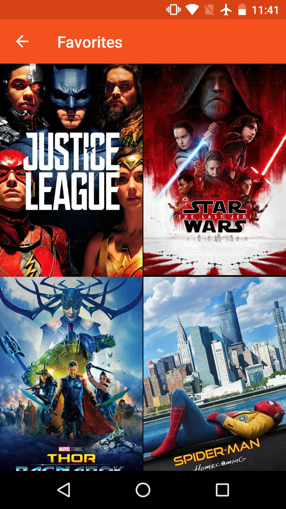


